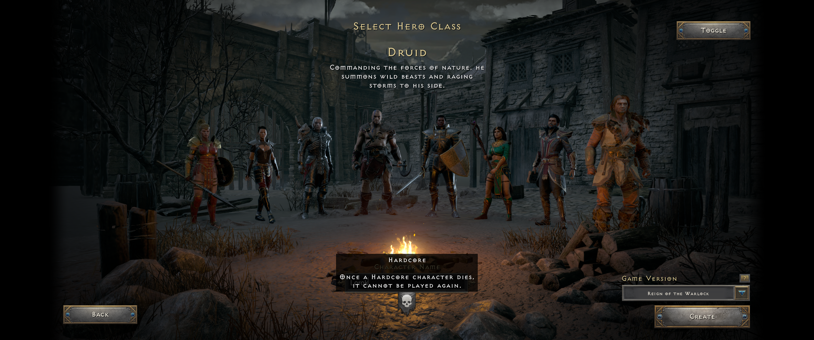
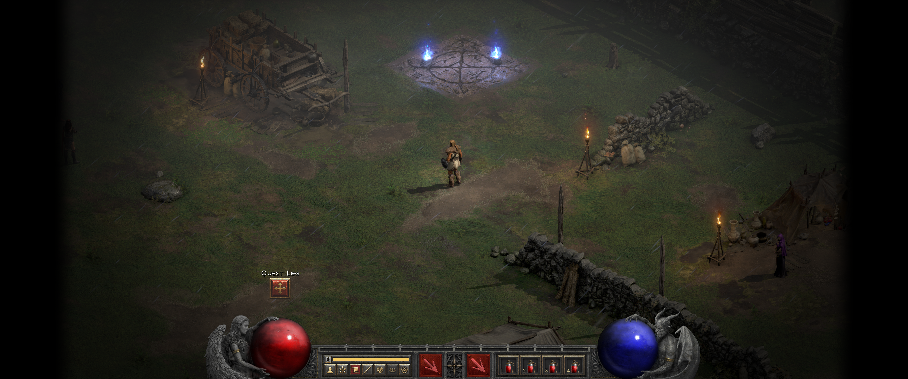

# Diablo II: Resurrected visual benchmarks

These two owner-supplied screenshots are composition and finish references for
Verdigris. They are here because phrases such as "AAA UI," "better town," or
"Diablo-like HUD" do not capture the spatial hierarchy, lighting, scale, and
interaction density visible in a finished game.

They are **not** asset sources or instructions to reproduce Diablo II:
Resurrected characters, scenery, ornament, typography, or layouts verbatim.
Verdigris must translate the principles below through its own Houses and
Scions fiction, floating-island front door, Crossroads, Framekit art, and
original world assets.

## Reference 1 — character selection as a living scene

### What the screenshot establishes

- Character selection is a place in the world, not a form floating in an empty
  application shell. The environment, weather, fire, characters, and camera do
  most of the presentation work.
- The full roster remains physically present. Selection is communicated with
  pose, placement, light, colour, and focus; it does not require a large card
  around every character.
- Information is layered over the scene with a strong hierarchy: the current
  choice and its description are central, while Back, Create, mode, and version
  controls stay at the edges.
- The active character receives attention without erasing the context of the
  other choices. Dimmed figures still contribute to fantasy and anticipation.
- The sparse interface lets the authored scene carry the emotional weight.
- Hardcore is a simple, contextual binary choice beside the character name.
  Its placement makes the consequence visible at the moment it matters without
  turning the choice into another screen or a multi-step settings flow.

### Translation for Verdigris

- The WIZARD `verdigris_splash` floating island should become the actual first
  screen, with authored atmosphere, depth, motion, drag orbit, and zoom.
- Scion admission/selection should feel like examining a living lineage in the
  world. Use the environment, camera, figure treatment, House heraldry, and
  lighting to identify the selected Scion before adding explanatory panels.
- `Enter the World`, `Forge a Wanderer`, and `Read the Chronicle` should be
  restrained scene overlays. House founding, Scion naming, and the mortal oath
  can use focused Framekit surfaces when input is required, but must not turn
  the whole front door into two giant empty panes.
- Preserve Verdigris's classless character identity. The screenshot's class
  roster is a staging reference, not a request to add classes.
- Treat the mortal oath with the same interaction economy as Hardcore: one
  clearly labelled toggle during Scion creation, an immediate selected state,
  and one concise permanent-death explanation beside it. Do not hide it in
  settings, require a separate mode-selection page, or surround it with
  redundant confirmation clicks. The final admission action must clearly
  reflect that the oath is active before the Scion is created.
- A selected Scion should remain legible at a glance through silhouette,
  lighting, stance, and a single concise identity block.

### Acceptance questions

- Would the screen still feel intentional with its labels temporarily hidden?
- Does the selected Scion read before the player reads their name?
- Is most of the screen a living scene rather than panel texture?
- Are the few available actions obvious without tutorial copy?
- Can the mortal oath be understood and selected in one action without leaving
  Scion creation?
- Does continuing into the world feel like entering the scene rather than
  leaving a menu application?

## Reference 2 — town and HUD as one composition

### What the screenshot establishes

- Town remains a playable world. The wagon, waypoint, torches, walls, tent,
  and NPCs are physical landmarks rather than entries in a service menu.
- Traversable ground and the player occupy the visual centre. Persistent UI
  hugs the bottom and edges instead of competing with the world.
- Lighting directs attention: cool ambient rain and waypoint light contrast
  with warm service and camp lights. Ground shadows anchor actors and props.
- The red and blue orbs are large, readable resources and signature sculpture
  at the same time. Their glass, liquid, highlight, and surrounding figures
  have enough finish to withstand their screen size.
- The central action belt is compact and symmetric. Primary actions are larger;
  potions and utility controls are subordinate but still readable.
- The quest affordance is a small, isolated notification. Detailed quest text
  is available on demand rather than permanently occupying the playfield.
- Vignette and contrast control create focus without covering the environment
  with opaque panels.

### Translation for Verdigris

- The Crossroads should communicate services spatially: Tamar at the
  Vesselforge, merchants at identifiable stalls, the fountain as the safe
  return point, and expedition travel through a physical portal or road gate.
- Hovering a portal or NPC should create an immediate white selection treatment;
  clicking should perform the contextual town interaction. Debug `N` travel
  and unnecessary confirmation windows are not part of the intended flow.
- Keep the Framekit HUD edge-bound. Enlarge and finish the health/spirit orb
  interiors while preserving the existing Verdigris statues and materials.
- The quickbar should expose bindable LMB, RMB, Q, E, R, and T actions. Each
  icon needs local state, including a radial clock wipe for cooldown, disabled
  treatment for unavailable skills, and a restrained ready response.
- The experience rail should feel integrated rather than sit in an opaque black
  rectangle. Unspent skill points and quest updates can use compact buttons or
  notices above it.
- The small minimap belongs in the HUD language. The large Tab map should draw
  translucent world edges over play, not replace the world with an opaque pane.
- Inventory and character sheets may occupy deliberate side panes, but routine
  combat and town navigation should leave the centre visually open.

### Acceptance questions

- Can the player identify the town's important services from the world itself?
- Does the game world remain the largest and highest-priority surface?
- Are health, spirit, actions, cooldowns, experience, and new-point state
  readable without a dense block of explanatory text?
- Do the orbs and Framekit elements look authored at their final display size,
  with no stretching, pixelation, flat fills, or accidental opaque rectangles?
- Can a player reach vendors, portals, loot, and NPC dialogue by acting on the
  world rather than remembering debug keys?

## Working rule

Use these screenshots during visual review to ask **why** their hierarchy
works, then solve the same problem in Verdigris's visual language. Match their
clarity, confidence, scene ownership, material finish, and restraint—not their
specific intellectual property.

Source: full-resolution 3440×1440 screenshots supplied by the project owner on
2026-09-03. Retained as internal visual-design references. Diablo II:
Resurrected and its assets belong to their respective rights holders.
