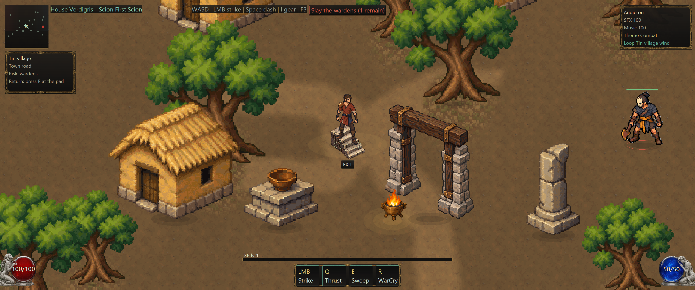
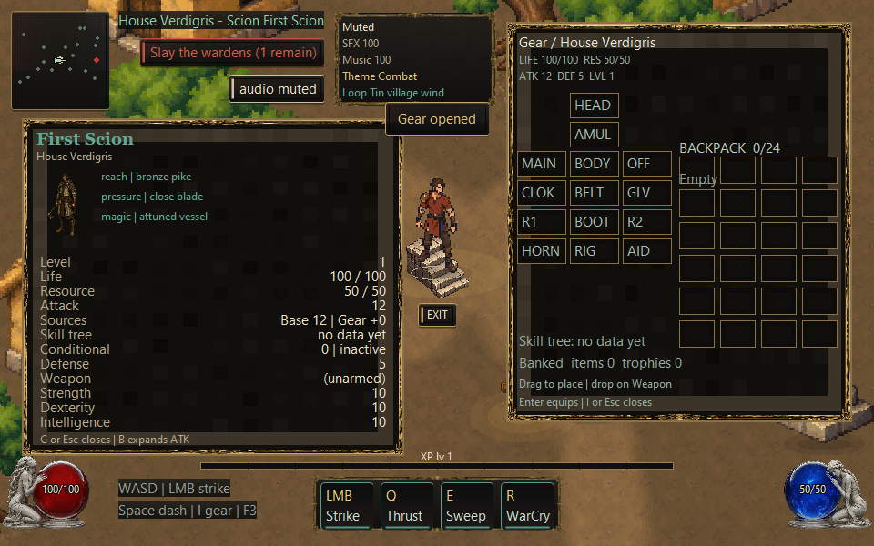

# Ground, motion registration and HUD review — September 10, 2026

This is a verified integration milestone in the isolated Diablo-study checkout,
not final visual acceptance. The catalog now contains 127 active assets. Exact
published workflows and their evidence limits remain in [RESEARCH.md](../../RESEARCH.md);
[PROMPTING.md](../../PROMPTING.md) records the selected recipe and local failures.

## Viewed production result

Root launched `native/tools/play-native.ps1 -Local`, captured the real window
with the supported PrintWindow helper, and inspected it. The scene uses quiet
earth, world-aligned paths around existing structures, readable landmark/actor
silhouettes and the common HUD skin. Escape closed the client with exit 0;
the launcher and refreshed window inventory verified no leftover local game.
[Session log](live-session.log).

Root inspected the 960x600 production image at native scale. Equipment vital
and combat-stat rows are separate, XP remains visible above its meter, and
audio/control regions clear the two panes. The retained fullscreen, 1366x768
and 960x600 captures expose the corresponding layouts. Long arbitrary owner
names are not covered by a general wrapping policy.

## Motion and source review

- NW frames have exact Y translations (+1px for phases 0–3; +5px for 4–7),
  with the same translations applied to hand/occlusion registrations. Body,
  colors, alpha and scale are unchanged. Root reviewed a production walking
  frame; the worker reviewed all 40 NW weapon composites. Residual proportions,
  tunic color and head bob differ across clips.
- Hero CSVs record real held WASD, authoritative 50ms movement steps and 15ms
  presentation updates. The scenario verifies that the first actual movement
  also displays the first walking pose, every phase appears, and stopping
  settles to idle. MP4s preserve the saved 60ms capture cadence at 50/3fps.
- Raider source and eight native poses were reviewed for axe continuity.
  `raider-phase-0.png` through `raider-phase-7.png` preserve every saved phase
  through the production renderer. The CSV is explicitly `scripted-asset-review`:
  collision-checked positions feed normal motion and drawing. The 75ms samples
  are encoded at 40/3fps. Native enemy AI itself remains stationary; browser
  remote snapshots can contain pursuit. This fixture does not add or prove AI.
- Clips are review aids encoded without frame interpolation. PNGs are the
  color authority; H264/yuv420p is lossy. Selected production PNGs and native
  pose/composite sheets were inspected; encoding alone is not playback review.

The NE contact-v6 candidate uses the prior accepted frame first and original
identity second, following the published Flixly reference arrangement. At
source pitch 11, its striking arm and a measured axe composite were accepted
as a single candidate. The next follow-through-v2 source switched arms and
its broad gray-background cleanup also erased real foreground. That phase
is rejected. Both packages remain outside runtime; fixing alpha alone would
not fix the source anatomy. These built-in-tool results cannot establish
performance of a particular Image 2.5 variant.

## Verification and retained failures

| Check | Final result |
|---|---|
| Supported native build and all scenarios | 66/66, exit 0 |
| Native core/network/camera/session/presentation/audio suites | Pass |
| `npm run playtest` | 32/32, exit 0 |
| Pixel Respecter importer tests | 7/7 |
| Equipment attachment | 54 poses × 5 weapons × 3 scales; ≤0.5px grip error |
| HUD measured labels | 378 route/theme/risk/return combinations; bounded caches |
| Responsive HUD helper | 60 viewport/pane/audio/connection cases |
| Ground cache | Bounds, eviction, negative camera, integer pan, source reload pass |
| 3440x1440 static paints | 20 frames; 23.258ms average |
| 3440x1440 moving paints | 20 frames; 24.715ms average, 36.620ms peak |

The 40ms average gates are unchanged. Moving paints follow actual authoritative
travel with the loaded scenery layout held stable; no measured frame is omitted.
The ground probe now uses the same default unoptimized compiler configuration
as the native client. Its earlier optimized result is retained with an explicit
flags note and must not be substituted for production timing. The latest
horizontal-interpolation reuse produces byte-identical comparison pixels.

Failures are kept because they explain the corrections:

- The initial 65/66 native run found equipment-stat overlap. Measured row height
  fixed it; the final small dual-pane review also caught and corrected XP
  caption placement. Earlier quickbar label overlaps and its faulty right-
  padding assertion are retained separately.
- The first raider fixture assumed native AI pursuit and recorded only a
  stationary idle. It failed. The replacement is honestly labeled scripted
  asset review and verifies the renderer rather than inventing native behavior.
- An initial moving profile included delayed route-entry processing that
  regenerated spawn-relative dressing after the review teleport. It incurred
  112 new tiles and a large first-frame cost. The fixture now consumes the real
  entry event before corridor selection and warmup; scenery stays stable during
  measurement. No production map or collision rule changed.
- Quiet earth reduces variance and local contrast but is not seamless. The
  recorded left/right edge mismatch exceeds internal neighbor differences.
  Repeat preview and the live scene were inspected; repetition remains a limit.

[retained-evidence.json](retained-evidence.json) maps each copied or encoded
artifact to its source and SHA-256. Retained text uses UTF-8 LF for durable Git
hashes; `source_sha256` preserves the original captured bytes where normalization
changed them. Images and clips retain exact binary bytes. Original Diablo art remains external and
private; no original D2 pixels are included in this review or runtime.
